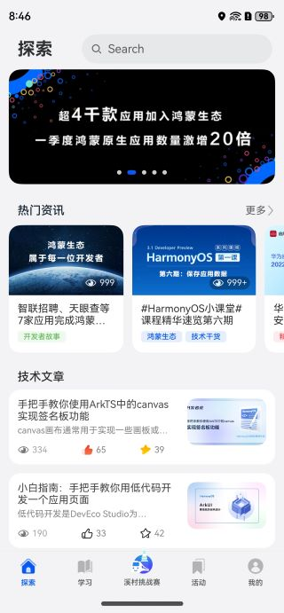
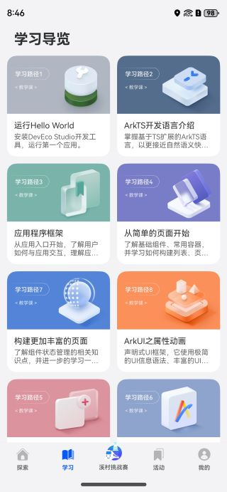
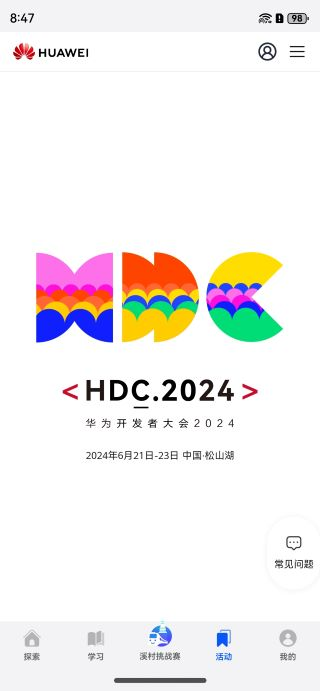
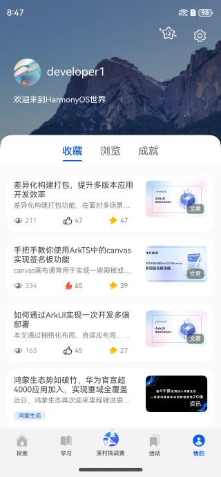

# HMOS世界

### 简介

基于分层架构和模块化设计的最佳实践，结合HarmonyOS"一次开发，多端部署"的能力，实现一款承载HarmonyOS最新技术特性，赋能HarmonyOS开发者的应用。

| 探索                                     | 学习                                         | 溪村挑战赛                                       | 活动                                         | 我的                                     |
|----------------------------------------|--------------------------------------------|---------------------------------------------|--------------------------------------------|----------------------------------------|
|  |  |  |  |  |

### 架构

#### 分层架构设计

HarmonyOS的分层架构主要包括三个层次：产品定制层、基础特性层和公共能力层。

本应用在产品定制层满足了不同设备类型的个性化需求。基础特性层提供了登录、我的、学习和发现等核心功能模块，为各设备提供通用的功能支持。公共能力层则提供了一套基础的开发组件和服务，包括公共UI组件、数据存储、网络和工具库，为应用开发提供了基础设施支持，
详见[最佳实践-分层架构设计](https://developer.huawei.com/consumer/cn/doc/harmonyos-guides-V5/bpta-layered-architecture-design-V5?catalogVersion=V5)。

#### 模块化设计

在HarmonyOS中，模块化不仅是一个设计原则，更是一种开发实践。它旨在将应用程序拆分为多个功能模块，每个功能模块负责特定的功能或特性。功能模块可以独立开发、编译和部署，也可以在不同的设备上灵活组合和调用，实现真正的多端协同。

本应用展现了HarmonyOS模块化设计的优势和实践方法，详见[最佳实践-模块化设计](https://developer.huawei.com/consumer/cn/doc/harmonyos-guides-V5/bpta-modular-design-V5?catalogVersion=V5)。

### 一次开发多端部署

本应用使用自适应布局和栅格布局等响应式布局方式，实现一套代码同时适配手机、折叠屏、平板等多种设备的能力。

### 性能

- 使用MVVM的设计模式，以实现更好的状态管理，减少应用的性能问题，详见[状态管理最佳实践](https://developer.huawei.com/consumer/cn/doc/harmonyos-guides-V5/bpta-status-management-V5?catalogVersion=V5)。
- 本应用中采用了属性动画、路径动画、粒子动画、lottie动画等方式实现了多种动画效果，详见[动画实践案例](https://developer.huawei.com/consumer/cn/doc/harmonyos-guides-V5/bpta-fair-use-animation-V5?catalogVersion=V5)。
- 本应用使用Navigation进行界面跳转，并使用了多种界面转场动画，详见[合理使用界面间转场](https://developer.huawei.com/consumer/cn/doc/harmonyos-guides-V5/bpta-page-transition-V5?catalogVersion=V5)。
- 使用懒加载和组件复用等方式提升长列表加载性能，详见[长列表加载性能优化](https://developer.huawei.com/consumer/cn/doc/harmonyos-guides-V5/bpta-best-practices-long-list-V5?catalogVersion=V5)。
- 本应用开发过程中，使用Frame分析、定位、解决卡顿问题，详见[滑动卡顿分析](https://developer.huawei.com/consumer/cn/doc/harmonyos-guides-V5/bpta-frame-practice-V5?catalogVersion=V5)。

### 安全

为增强用户对于个人数据隐私保护的控制和知情权，本应用添加了用户隐私说明弹窗，首次启动获得用户同意后，应用才能开始正常使用，详见[隐私保护最佳实践](https://developer.huawei.com/consumer/cn/doc/harmonyos-guides-V5/bpta-app-privacy-protection-V5?catalogVersion=V5)。

### 相关权限

1. 获取位置权限：ohos.permission.APPROXIMATELY_LOCATION，ohos.permission.LOCATION。
2. 网络权限：ohos.permission.INTERNET，ohos.permission.GET_NETWORK_INFO。
3. 后台任务权限：ohos.permission.KEEP_BACKGROUND_RUNNING。
4. 相册管理权限：ohos.permission.WRITE_IMAGEVIDEO。
5. 分布式数据同步权限：ohos.permission.DISTRIBUTED_DATASYNC。

### 约束与限制

1. 本示例仅支持标准系统上运行，支持设备：华为手机。
2. HarmonyOS系统：HarmonyOS NEXT Developer Beta1及以上。
3. DevEco Studio版本：DevEco Studio NEXT Developer Beta1及以上。
4. HarmonyOS SDK版本：HarmonyOS NEXT Developer Beta1 SDK及以上。

### 使用说明

1. 本示例数据请求使用的是AGC云函数，AGC服务端和客户端的配置信息是与bundleName一一对应的，运行安装时随意修改本示例的bundleName可能会导致网络请求失败。
2. 本示例用到了地图和华为快捷登录功能，如果想体验这两个功能，需要用本示例build-profile.json5文件中配置的签名信息安装运行。